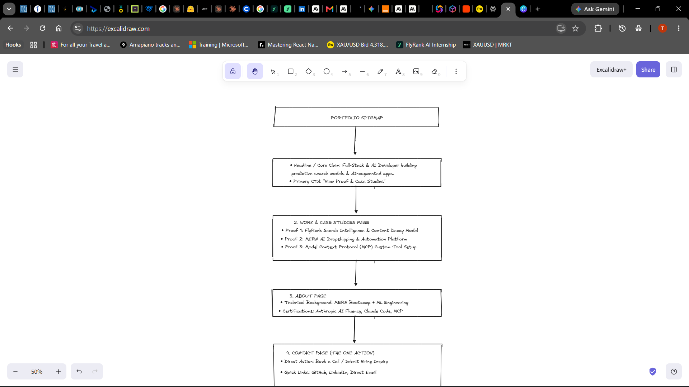
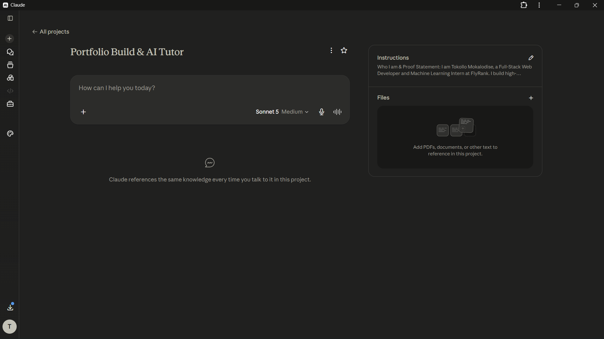

# FL-01: Portfolio Sitemap & AI Tutor Pressure Test

## 1. Portfolio Sitemap Sketch

---

## 2. Claude Project Setup & Custom Instructions

* **Project Name:** Portfolio Build & AI Tutor
* **Persona/Role:** AI Tutor & Product Mentor

---

## 3. Pressure-Test Prompt Executed

> "Here is my proposed portfolio sitemap designed to convert technical recruiters and hiring managers into reaching out for AI/Full-Stack roles..."

---

## 4. Critical Feedback Received & Key Refinements

### Feedback Summary:
* **Generic Claim:** Job title language ("Full-Stack & AI Developer") doesn't stand out in an 8-second scan; it requires front-loaded, quantified metrics.
* **Page Fluff:** A separate "About" page adds unnecessary click friction before recruiters see actual proof.
* **Missing Resume Action:** Technical recruiters want an immediate 1-click PDF resume download rather than just a contact form.

### The 3 Changes Applied:
1. **Front-Loaded Hero Metrics Strip:** Added 3 hard proof metrics right under the main headline (*0.84+ ROC-AUC decay detection*, *3 REST APIs integrated*, *100% MCP protocol compliance*).
2. **Single-Scroll Architecture:** Eliminated the standalone "About" page and condensed credentials into a scannable 15-second strip above the footer—zero extra clicks needed.
3. **One-Click Resume Action:** Added a prominent "Download CV (PDF)" button to both the Hero section and the Contact area.
